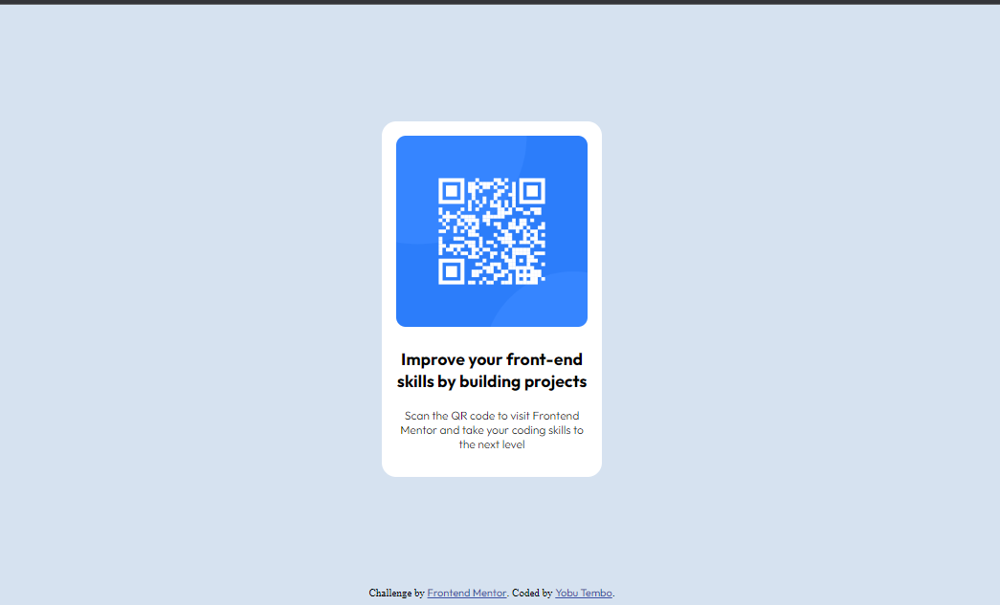

# Frontend Mentor - QR code component solution

This is a solution to the [QR code component challenge on Frontend Mentor](https://www.frontendmentor.io/challenges/qr-code-component-iux_sIO_H). Frontend Mentor challenges help you improve your coding skills by building realistic projects. 

## Table of contents

- Overview
  - Screenshot
  - Links
- [My process]
  - [Built with]
  - [What I learned]
  - [Continued development]
  - [Useful resources]
- Author
- Acknowledgments

## Overview

### Screenshot



### Links

- Solution URL:  https://ur-dad24.github.io/frontend-mentor-qr-code.github.io/

## My process

### Built with

- Semantic HTML5 markup
- CSS custom properties
- Flexbox

### What I learned

During this project, I learned how to create a responsive QR code component using HTML and CSS. I used flexbox to center the content vertically and horizontally within the parent container. I also applied styling to the QR code image and the text content using CSS properties such as `border-radius`, `padding`, and `font-family`. 

Here's an example of the code I'm proud of:

```css
.container {
  text-align: center;
  background-color: hsl(0, 0%, 100%);
  width: 230px;
  padding: 15px 0;
  border-radius: 15px;
}
```

### Continued development

In future projects, I want to continue focusing on improving my CSS skills, particularly in layout and responsiveness. I also plan to explore more advanced CSS techniques and frameworks to enhance the design and functionality of my projects.

### Useful resources

- [MDN Web Docs](https://developer.mozilla.org/): This is my go-to resource for learning HTML, CSS, and JavaScript. It provides detailed explanations and examples for various web development concepts.
- [CSS-Tricks](https://css-tricks.com/): This website offers a wealth of CSS-related articles, tutorials, and code snippets. It's a great resource for learning and staying up-to-date with the latest CSS techniques.

## Author

- Name -Yobu Tembo
- Frontend Mentor - [@Ur-dad24](https://www.frontendmentor.io/profile/Ur-dad24)
- Twitter - [@yobu_tembo](https://www.twitter.com/yobu_tembo)

## Acknowledgments

I would like to acknowledge Frontend Mentor for providing this challenge and the opportunity to practice and improve my frontend skills.